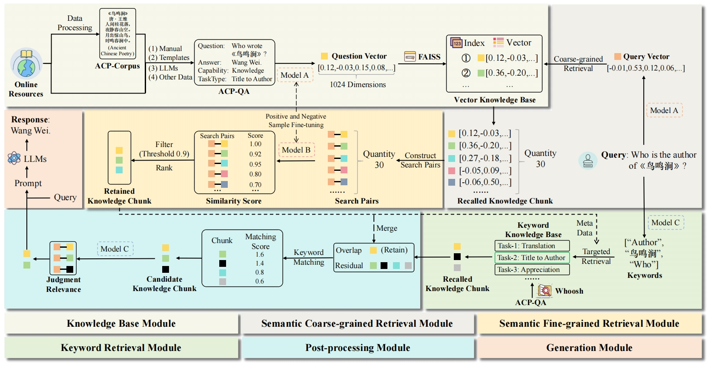
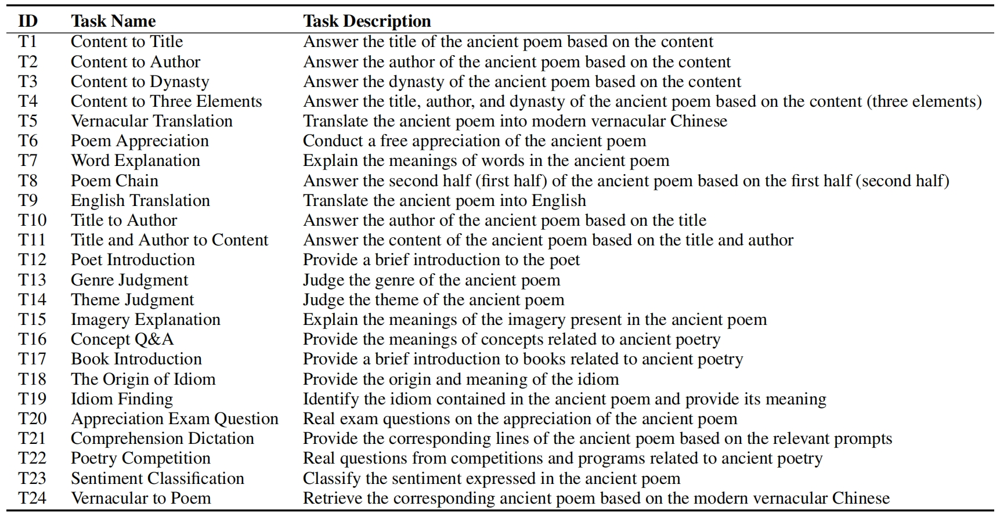
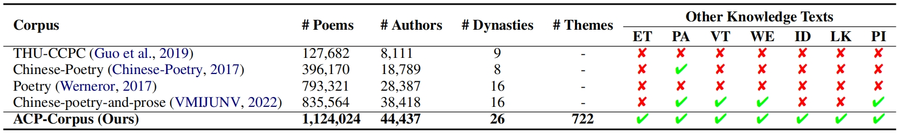
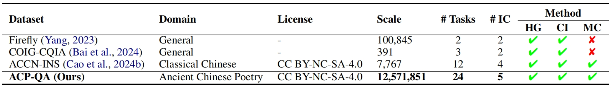
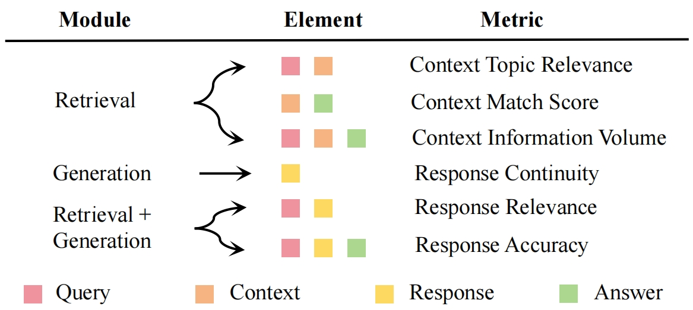
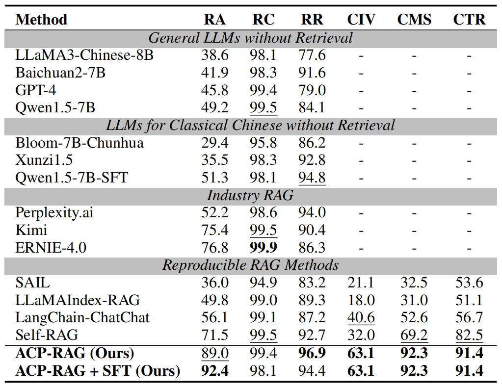

# ACP-RAG
[NAACL 2025] Large-Scale Corpus Construction and Retrieval-Augmented Generation for Ancient Chinese Poetry: New Method and Data Insights

## Introduction
**Ancient Chinese Poetry (ACP)**, a critical aspect of Chinese cultural heritage, presents unique challenges for Large Language Models (LLMs), primarily due to significant hallucination issues arising from data scarcity and the limited ability of general LLMs to handle ACP. To address these challenges, this paper introduces the **ACP-Corpus**, comprising 1.1 million ancient poems and 990K related texts, designed to enhance LLM training and performance. Additionally, we develop the **ACP-QA** dataset, containing over 12 million question-answer pairs across 24 task categories, and the **ACP-Eval** dataset with 7,050 entries for rigorous evaluation. Building upon these resources, we propose the **ACP-RAG** framework, a specialized Retrieval-Augmented Generation (RAG) approach that improves LLM performance in the ACP domain from 49.2% to 89.0%. The ACP-RAG consists of five modules: **semantic coarse-grained retrieval, semantic fine-grained retrieval, keyword retrieval, keyword matching, and context filtering**. Experimental results demonstrate that ACP-RAG achieves a promising response accuracy of 89.0%, surpassing existing LLMs by a remarkable margin. This work not only advances the capabilities of LLMs in processing ancient Chinese poetry but also contributes to the preservation and innovative development of this rich literary tradition.

<div align="center">
  
</div>

<div align="center">
Figure 1: Overview of the ACP-RAG framework. Model A is the embedding model, Model B is the rank model, and Model C is the keyword extraction and context filtering model (Qwen1.5-7B). Zoom in for better view.
</div>

## Task Description

<div align="center">
Table 1: Description of 24 ancient Chinese poetry tasks.
</div>

<div align="center">
  
</div>

## ACP-Corpus

<div align="center">
Table 2: Comparison of existing pre-training corpora. “ET” indicates English Translation, “PA” indicates Poem Appreciation, “VT” indicates Vernacular Translation, “WE” indicates Word Explanation, “ID” indicates Idioms, “LK” indicates Literary Knowledge, and “PI” indicates Poet Introduction.
</div>

<div align="center">
  
</div>

## ACP-QA

<div align="center">
Table 3: Comparison of existing Q&A datasets. “IC” indicates Instruction Categories, “HG” indicates Human Generated, “CI” indicates Collection and Improvement of existing datasets, and “MC” indicates Model Constructed.
</div>

<div align="center">
  
</div>

## Evaluation Metrics

<div align="center">
  
</div>

<div align="center">
Figure 2: RAG evaluation system.
</div>

## Result

<div align="center">
Table 4: Comparison between ACP-RAG and other methods on ACP-Eval. “RA” indicates Response Accuracy, “RC” indicates Response Continuity, “RR” indicates Response Relevance, “CIV” indicates Context Information Volume, “CMS” indicates Context Match Score, and “CTR” indicates Context Topic Relevance.
</div>

<div align="center">
  
</div>

## Data Acquisition Method

The ACP-Corpus (or ACP-QA) dataset is only available for non-commercial research purposes. Scholars or organizations interested in using the ACP-Corpus dataset are required to fill out this [application form](Application_Form_for_Using_ACP-Corpus.docx) and send it to us via email. When submitting the application form, please list or attach 1-2 papers you have published in the past 6 years to demonstrate that you (or your team) are conducting research in the field of Classical Chinese Studies. Once we receive and approve your application, we will provide a download link and extraction password. All users must comply with the usage terms; failure to do so will result in the revocation of authorization.

## Embedding and Rank Model Acquisition Methods

The embedding and rank model can be downloaded from [https://huggingface.co/ethanyt/guwenbert-base](https://huggingface.co/ethanyt/guwenbert-base). You can train your own models using the scripts in the `Model_Training` folder: `Embedding_Model_Training.py` for embedding models and `Rank_Model_Training.py` for rank models. Alternatively, you may use other open-source embedding models that are more advanced or better suited for your specific needs.

## Setup

```
cd ACP-RAG
pip install -r requirements.txt
```

## ACP-RAG Pipeline

### Construct Knowledge Base Index

**1. Build Whoosh keyword index for a single task (or "all")**
```
python Index_Creation/01_Create_Keyword_Index.py
```

**2. Compute and save FAISS vector indexes in parts**
```
python Index_Creation/02_Create_Vector_Index.py
```

**3. Merge all FAISS parts into one index**
```
python Index_Creation/03_Merge_Vector_Index.py
```

### Retrieve

**1. Select candidate contexts via vector + BM25 retrieval + ranking**
```
python ACP-RAG_Pipeline/01_Context_Selector.py
```

**2. Filter selected contexts with an LLM-based scorer**
```
python ACP-RAG_Pipeline/02_Context_Filter.py
```

**3. Generate final responses using filtered contexts**
```
python ACP-RAG_Pipeline/03_Response_Generation.py
```

### Evaluate

The `Evaluation_Metrics` folder contains six scoring scripts: `Context_Information_Volume.py`, `Context_Match_Score.py`, `Context_Topic_Relevance.py`, `Response_Accuracy.py`, `Response_Continuity.py`, and `Response_Relevance.py` for computing different evaluation metrics. The scoring model `Qwen1.5-7B_scoring_ver1` will be open-sourced in a subsequent release.

## Citation

```
@article{liu2025acprag,
  title={Large-Scale Corpus Construction and Retrieval-Augmented Generation for Ancient Chinese Poetry: New Method and Data Insights},
  author={Liu, Yang and Lan, Lan and Cao, Jiahuan and Cheng, Hiuyi and Ding, Kai and Jin, Lianwen},
  journal={NAACL 2025},
  year={2025}
}
```

## License


The work is licensed under a [MIT License](https://lbesson.mit-license.org/).


The datasets are licensed under a [Creative Commons Attribution-NonCommercial-ShareAlike 4.0 International License](https://creativecommons.org/licenses/by-nc-sa/4.0/).

## Contact

Yang Liu: ly10061105@gmail.com


